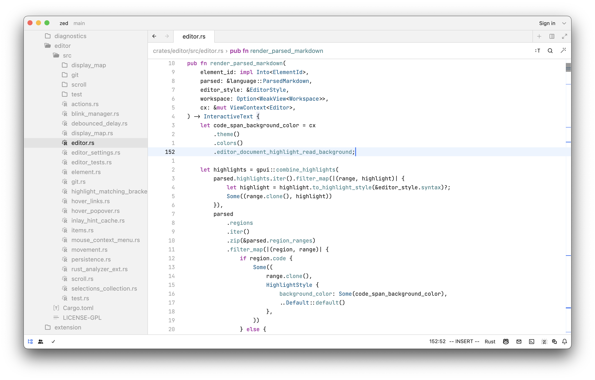
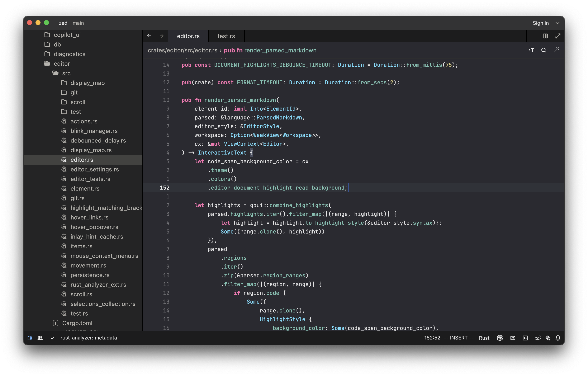
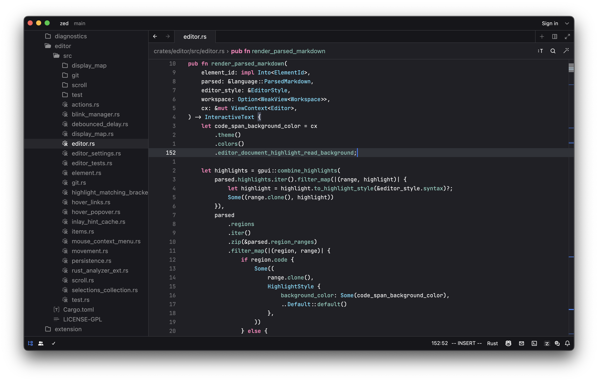

# Zed Xcode Themes

A port of Xcode's default themes to the Zed code editor. These themes are designed to be as close to the original Xcode themes as possible, with some minor adjustments to make them look better in Zed.

## Contributing

If you find any issues with the themes, or have any suggestions for improvements, please open an issue or a pull request.
