# Zed Xcode Themes

A port of Xcode's default themes to [Zed](https://zed.dev/)

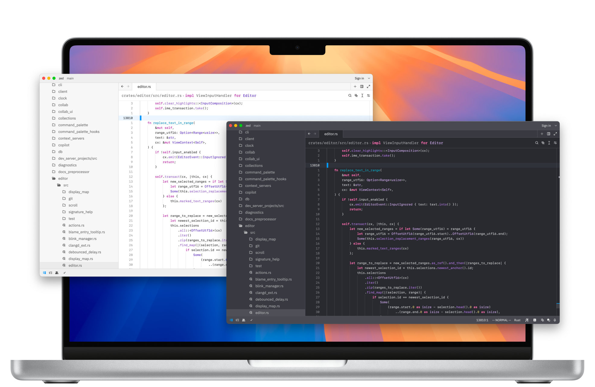

## Themes

These themes are designed to be as close to the original Xcode themes as possible, with some minor adjustments to make them look better in Zed.

Classic Dark

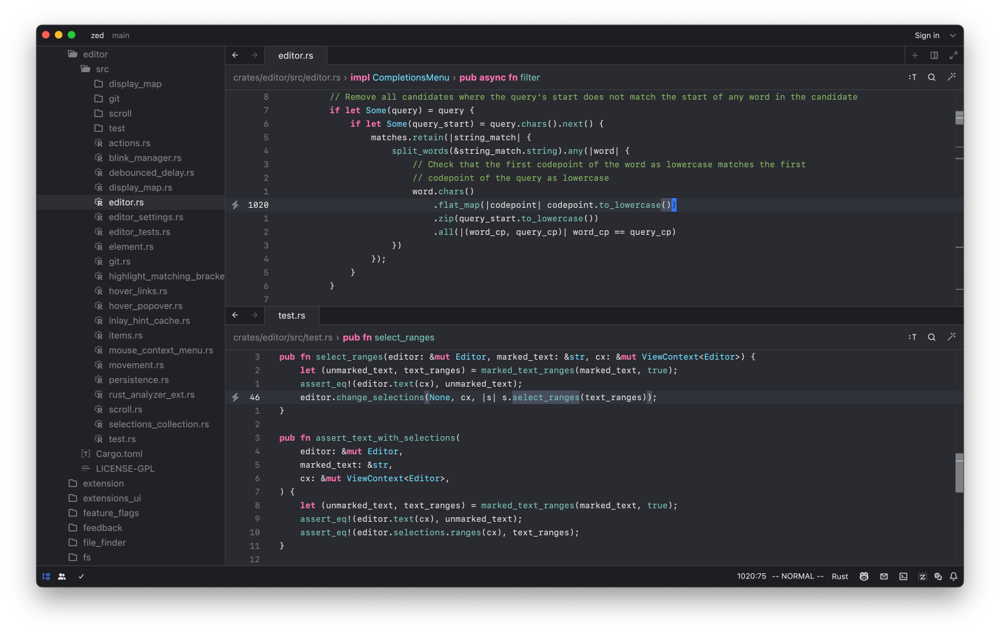

Default Dark

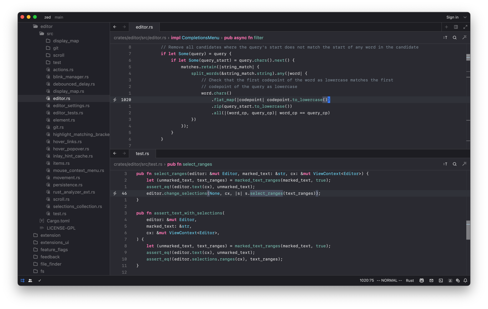

High Contrast Dark

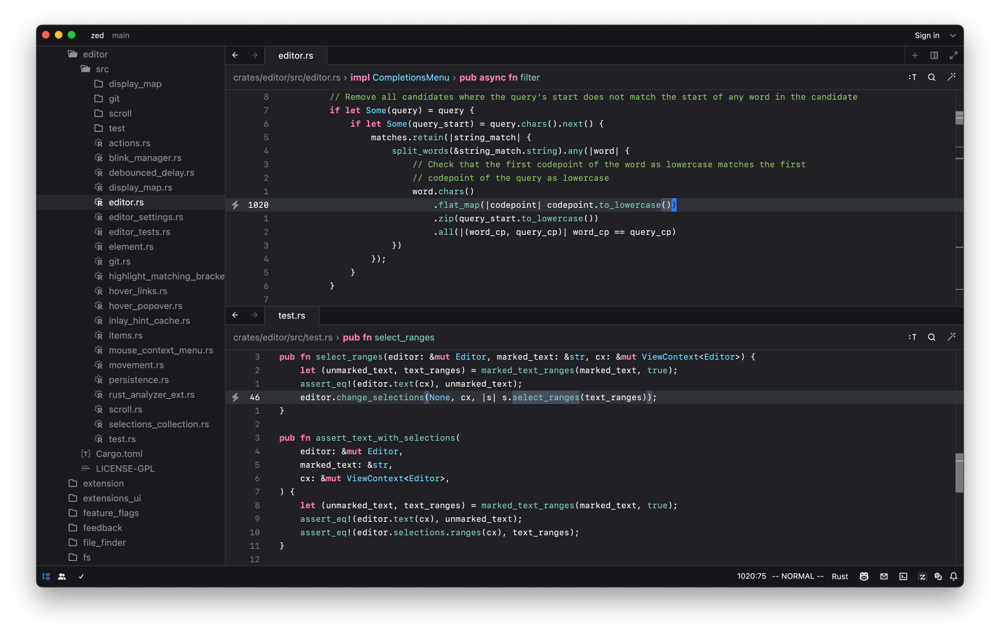

Midnight

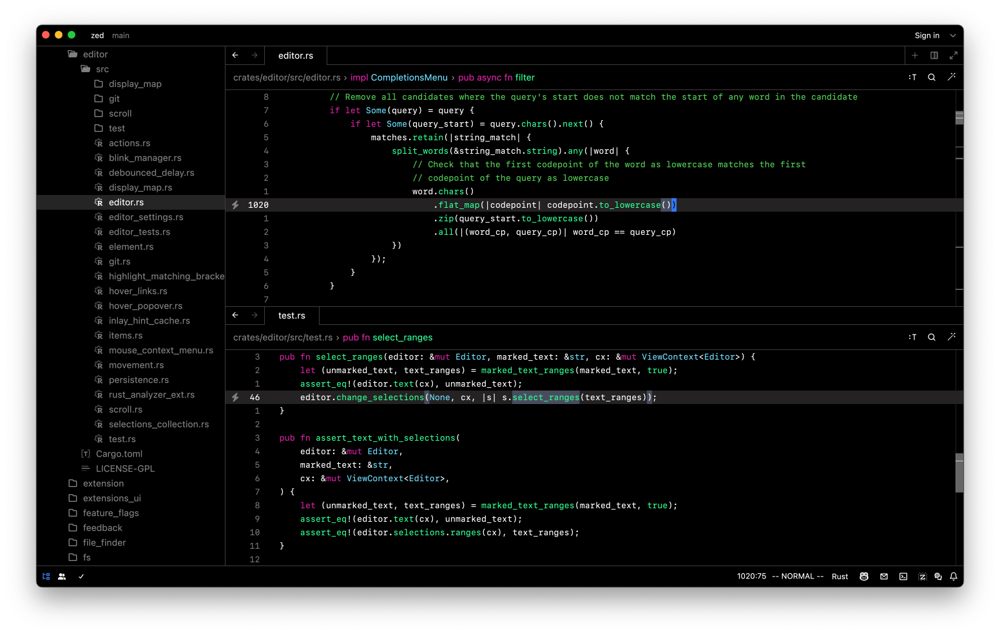

Presentation Dark

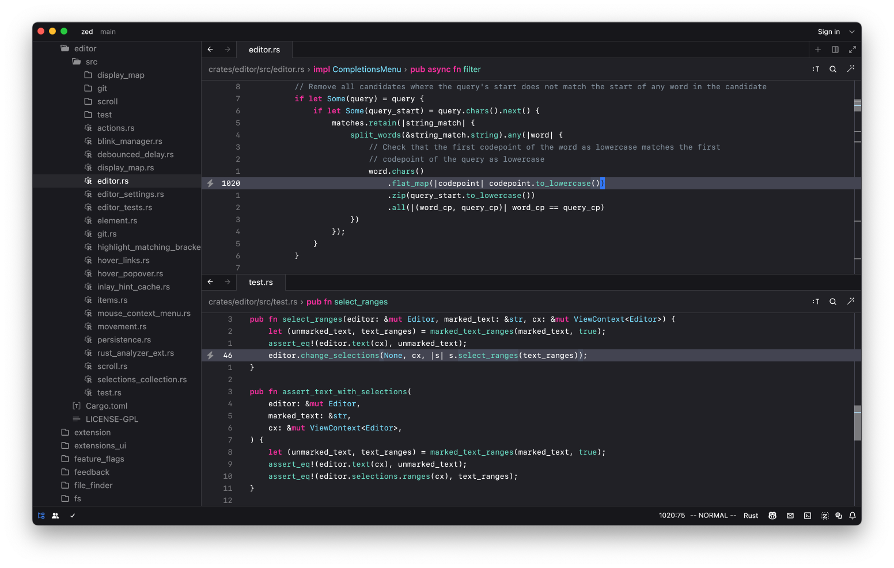

Bare

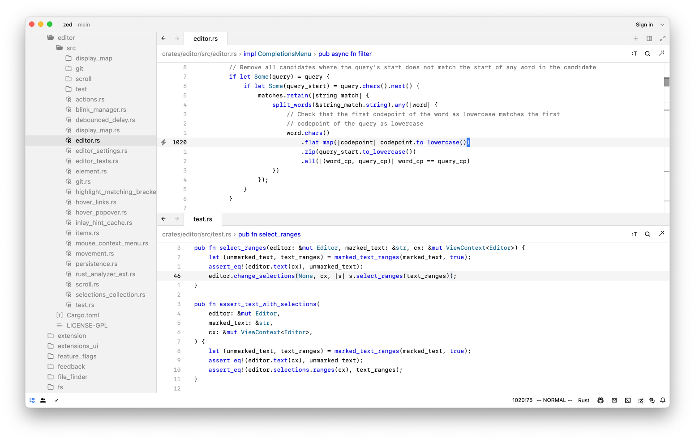

Basic

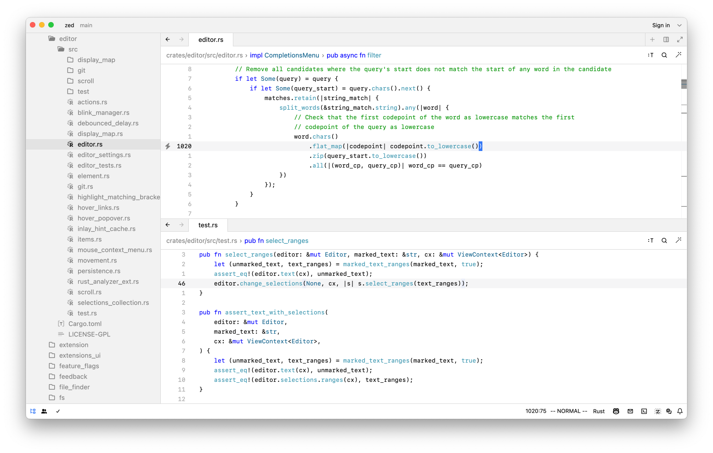

Classic Light

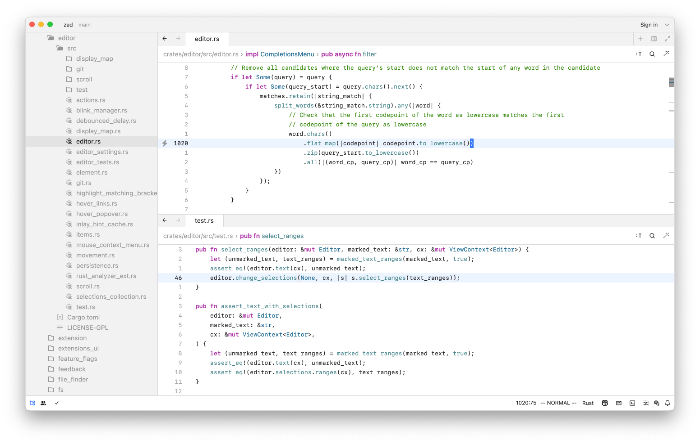

Default Light

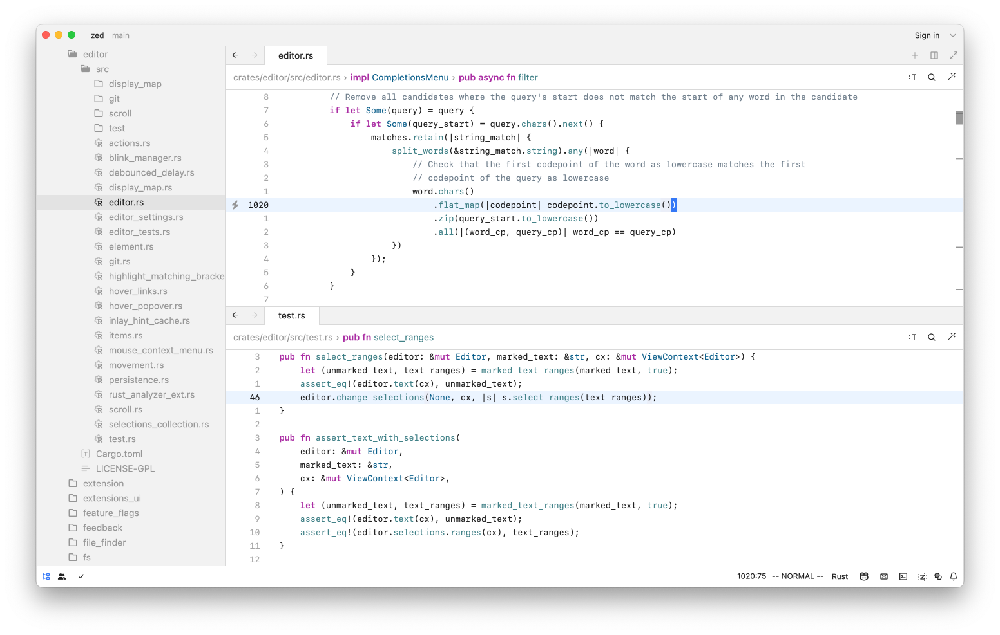

High Contrast Light

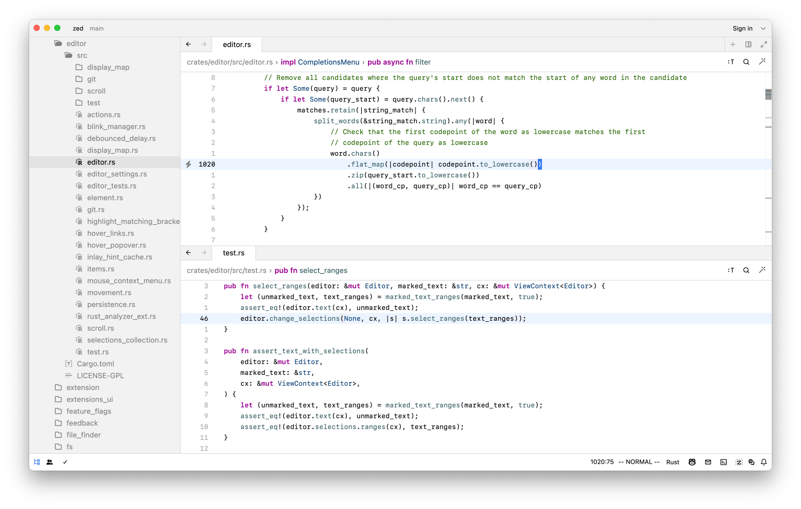

Low Key

Presentation Light

Spartan

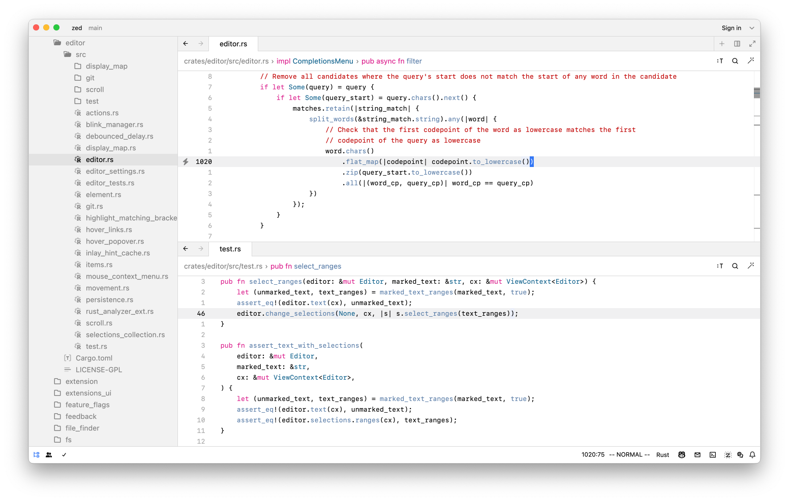

Sunset

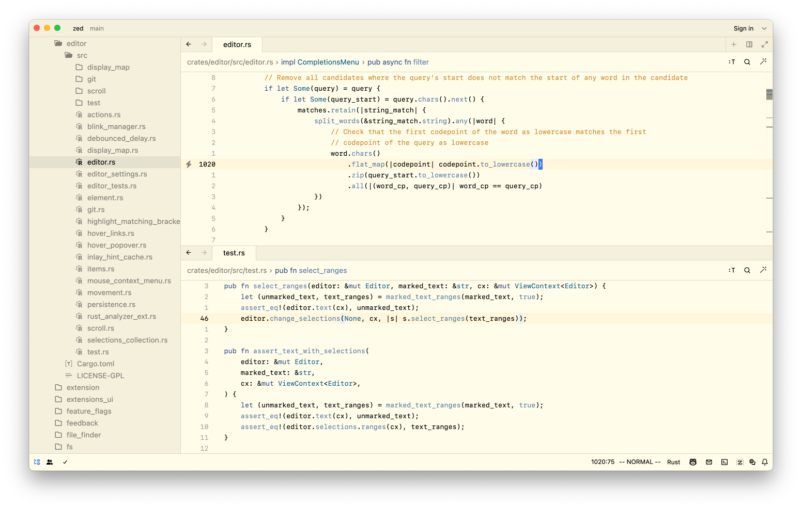

## Contributing

If you find any issues with the themes, or have any suggestions for improvements, please open an issue or a pull request.
